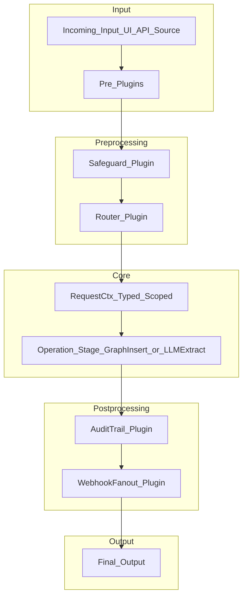

# 🔄 Lifecycle, Plugins & Extensibility

> *"Every request is a journey: prepare, act, reflect."*  
> This document explains how TelaMentis turns that journey into a **pipeline of pluggable steps** implemented in Phase 2.

**Implementation Status: ✅ Phase 2 Complete**

---

## 1 Conceptual Model



| Stage          | What Runs Here                                | Typical Plugins (built-in)          |
|----------------|----------------------------------------------|-------------------------------------|
| **Pre-process**| Fast validation, auth, routing               | *AuthGuard*, *Safeguard*, *Router*  |
| **Operation**  | Core graph actions or LLM extraction         | *GraphInsert*, *LLMExtract*         |
| **Post-process**| Auditing, notifications, cache refresh      | *AuditTrail*, *WebhookFanout*       |

Each plugin is a **Rust trait object** loaded from a registry at runtime, so you can mix compiled-in crates *and* dynamically discovered `.so`/`.dll` bundles.

## Current Implementation (Phase 2)

### Pipeline Stages

```rust
#[derive(Debug, Clone, PartialEq, Eq)]
pub enum PipelineStage {
    PreOperation,   // Authentication, validation, preparation
    Operation,      // Core business logic (handled outside pipeline)
    PostOperation,  // Auditing, notifications, cleanup
}
```

### Built-in Plugins

TelaMentis ships with several built-in plugins:

```rust
// Request logging for all stages
pub struct RequestLoggingPlugin;

// Tenant validation for tenant-scoped operations
pub struct TenantValidationPlugin;

// Audit trail for compliance and debugging
pub struct AuditTrailPlugin;
```

### Plugin Registration

```rust
// From FastAPI bridge initialization
let mut pipeline = PipelineRunner::new();

// Register built-in plugins
pipeline.register_plugin(PipelineStage::PreOperation, Arc::new(RequestLoggingPlugin::new()));
pipeline.register_plugin(PipelineStage::PreOperation, Arc::new(TenantValidationPlugin::new()));
pipeline.register_plugin(PipelineStage::PostOperation, Arc::new(AuditTrailPlugin::new()));
```

### Request Flow

```rust
// Create request context
let mut ctx = RequestContext::new("POST".to_string(), "/graph/tenant/nodes".to_string());
ctx.tenant_id = Some(TenantId::new("tenant"));

// Execute pipeline
let processed_ctx = pipeline.execute(ctx).await?;

// Check for errors or halts
if let Some(error) = processed_ctx.error {
    return Err(error);
}
```

---

## 2 `Plugin` Trait

```rust
#[async_trait::async_trait]
pub trait Plugin: Send + Sync {
    /// Called once after the plugin is loaded.
    async fn init(&self, cfg: &PluginConfig) -> Result<()>;
    

    /// Mutates or inspects the request context.
    async fn call(&self, ctx: &mut RequestCtx) -> Result<PluginOutcome>;

    /// Optional shutdown hook.
    async fn teardown(&self) {}
}

pub enum PluginOutcome {
    /// Continue to the next stage.
    Continue,
    /// Short-circuit the pipeline and return this response.
    Halt(HttpResponse),
}
```

Every stage owns its own `Vec<Box<dyn Plugin>>`.
A single plugin can be registered in multiple stages if desired (e.g. a Metrics plugin that timestamps before and after the operation).

⸻

## 3 Current Plugin Examples

### Tenant Validation Plugin

```rust
pub struct TenantValidationPlugin;

#[async_trait]
impl PipelinePlugin for TenantValidationPlugin {
    fn name(&self) -> &'static str {
        "TenantValidation"
    }
    
    async fn init(&mut self, _config: PluginConfig) -> Result<(), Box<dyn std::error::Error + Send + Sync>> {
        info!("Initialized TenantValidation plugin");
        Ok(())
    }
    
    async fn call(&self, ctx: &mut RequestContext) -> PluginOutcome {
        // Check if tenant is required for this endpoint
        if ctx.path.contains("/graph/") || ctx.path.contains("/llm/") {
            if ctx.tenant_id.is_none() {
                warn!("Request to {} requires tenant but none provided", ctx.path);
                ctx.error = Some("Tenant ID is required for this operation".to_string());
                return PluginOutcome::Halt;
            }
        }
        
        PluginOutcome::Continue
    }
}
```

### Audit Trail Plugin

```rust
pub struct AuditTrailPlugin;

#[async_trait]
impl PipelinePlugin for AuditTrailPlugin {
    fn name(&self) -> &'static str {
        "AuditTrail"
    }
    
    async fn call(&self, ctx: &mut RequestContext) -> PluginOutcome {
        // Log the request details
        info!(
            "Audit: {} {} by tenant {:?} (request_id: {})",
            ctx.method,
            ctx.path,
            ctx.tenant_id,
            ctx.request_id
        );
        
        // Store audit information in context
        ctx.set_attribute("audit_timestamp", serde_json::json!(chrono::Utc::now().to_rfc3339()));
        ctx.set_attribute("audit_logged", serde_json::json!(true));
        
        PluginOutcome::Continue
    }
}
```

## 4 Future: Configuration-Based Pipeline

Future versions will support YAML-based configuration:

```yaml
# config.yaml (planned for future phases)
pipeline:
  pre:
    - name: Safeguard
      crate: telamentis-safeguard
      config:
        max_request_size: 8KB
    - name: TenantValidation
      enabled: true
  operation:
    - name: CoreOperation
  post:
    - name: AuditTrail
```

## 5 Building Custom Plugins

Currently, custom plugins are built as Rust implementations:

```sh
cargo new --lib plugins/my_router
```

```rust
// plugins/my_router/src/lib.rs
use telamentis_core::{Plugin, RequestCtx, PluginOutcome};

pub struct MyCustomPlugin {
    name: &'static str,
}

impl MyCustomPlugin {
    pub fn new() -> Self {
        Self { name: "MyCustomPlugin" }
    }
}

#[async_trait::async_trait]
impl PipelinePlugin for MyCustomPlugin {
    fn name(&self) -> &'static str {
        self.name
    }
    
    async fn init(&mut self, _cfg: PluginConfig) -> Result<(), Box<dyn std::error::Error + Send + Sync>> {
        Ok(())
    }
    
    async fn call(&self, ctx: &mut RequestContext) -> PluginOutcome {
        // Custom logic here
        Ok(PluginOutcome::Continue)
    }
}
```

Add to workspace or build a cdylib:

```toml
[lib]
crate-type = ["cdylib"]
```

## 6 Current Limitations and Future Plans

### Current (Phase 2)
- ✅ Plugin trait definition and execution framework
- ✅ Built-in plugins (RequestLogging, TenantValidation, AuditTrail)
- ✅ Pipeline stages (PreOperation, Operation, PostOperation)
- ✅ Integration with FastAPI bridge
- ✅ Comprehensive testing

### Future Phases
- 🔄 Configuration-based plugin registration (YAML/TOML)
- 🔄 Dynamic plugin loading from shared libraries
- 🔄 Web UI for pipeline visualization and management
- 🔄 Plugin dependencies and conditional execution
- 🔄 Hot-reloading capabilities

## 7 Integration Recipes

| Goal | How the Pipeline Helps |
|------|-----------------------|
| Validate tenant access before graph operations | TenantValidation plugin in PreOperation stage automatically validates tenant context |
| Audit all API calls for compliance | AuditTrail plugin in PostOperation stage logs all request details |
| Add request timing and performance monitoring | RequestLogging plugin tracks request lifecycle and timing |
| Custom authentication for enterprise deployment | Implement custom AuthPlugin in PreOperation stage |
| Rate limiting per tenant | Implement RateLimitPlugin with tenant-aware limits |

## 8 Testing Your Plugins

```rust
#[tokio::test]
async fn test_custom_plugin() {
    let plugin = MyCustomPlugin::new();
    let mut ctx = RequestContext::new("GET".to_string(), "/test".to_string());
    
    let outcome = plugin.call(&mut ctx).await;
    
    match outcome {
        PluginOutcome::Continue => {
            // Assert expected behavior
        }
        _ => panic!("Unexpected outcome"),
    }
}
```

## 9 Performance Considerations

The pipeline is designed for minimal overhead:

- Plugins execute sequentially within each stage
- Context passing uses efficient clone operations
- Error handling avoids unnecessary allocations
- Built-in plugins have microsecond-level execution times

## 10 Edge Cases & Current Guarantees

- **Error Isolation**: Plugin failures don't crash the entire request pipeline
- **Context Preservation**: Request context maintains state across plugin executions
- **Halt Semantics**: Plugins can cleanly halt processing with meaningful error messages
- **Tenant Isolation**: Tenant validation ensures proper data isolation
- **Audit Trail**: All requests are logged for debugging and compliance

The current Phase 2 implementation provides a solid foundation for the extensible request processing envisioned in the original design, with room for future enhancements as TelaMentis evolves.