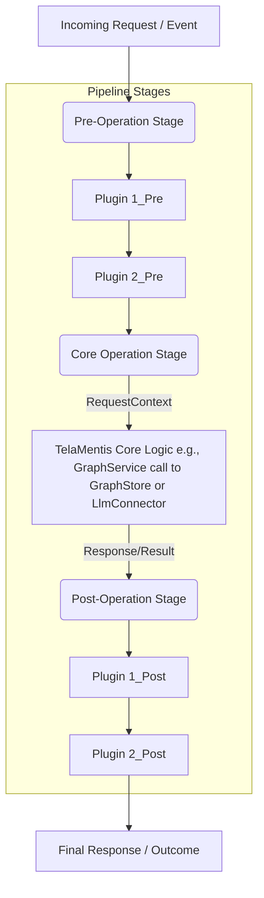

# 🔄 Request Processing Pipeline in TelaMentis

Beyond the adapter pattern for external services (`GraphStore`, `LlmConnector`, etc.), TelaMentis incorporates a powerful internal request processing pipeline as of Phase 2. This allows for modular, composable extensions to the core request lifecycle, enabling features like authentication, validation, auditing, and custom business logic to be injected without modifying `telamentis-core` itself.

**Implementation Status: ✅ Phase 2 Complete**

## 1. Conceptual Overview

The request processing pipeline allows developers to insert custom logic at various stages of a request's journey through TelaMentis. A "request" here can be an API call to a Presentation Adapter or an internal event triggering a core operation.



- **Stages**: The pipeline is divided into logical stages (e.g., Pre-Operation, Post-Operation).
- **Plugins**: Custom Rust components (implementing a PipelinePlugin trait) are registered to run within these stages.
- **RequestContext**: A central data structure (RequestContext) is passed through the pipeline. Plugins can read from and mutate this context. It carries request details, authentication information, intermediate results, and can serve as a service locator.
- **Control Flow**: Plugins can influence the pipeline's execution, e.g., by halting further processing and returning an immediate response, or by modifying the context for subsequent plugins or the core operation.

## 2. Current Implementation

### The PipelinePlugin Trait

```rust
// From telamentis-core/src/traits.rs
use async_trait::async_trait;

#[async_trait]
pub trait PipelinePlugin: Send + Sync {
    /// A unique identifier for the plugin
    fn name(&self) -> &'static str;
    
    /// Called once when the plugin is loaded and initialized
    async fn init(&mut self, config: PluginConfig) -> Result<(), Box<dyn std::error::Error + Send + Sync>>;
    
    /// Executes the plugin's logic
    async fn call(&self, ctx: &mut RequestContext) -> PluginOutcome;
    
    /// Optional: Called during graceful shutdown
    async fn teardown(&self) -> Result<(), Box<dyn std::error::Error + Send + Sync>> {
        Ok(())
    }
}
```

### RequestContext Structure

```rust
// From telamentis-core/src/traits.rs
#[derive(Debug, Clone)]
pub struct RequestContext {
    pub request_id: Uuid,
    pub tenant_id: Option<TenantId>,
    pub method: String,
    pub path: String,
    pub headers: HashMap<String, String>,
    pub raw_request: Option<serde_json::Value>,
    pub core_operation_input: Option<serde_json::Value>,
    pub core_operation_output: Option<serde_json::Value>,
    pub final_response: Option<serde_json::Value>,
    pub attributes: HashMap<String, serde_json::Value>,
    pub start_time: std::time::Instant,
    pub error: Option<String>,
}

impl RequestContext {
    pub fn new(method: String, path: String) -> Self { /* ... */ }
    pub fn elapsed(&self) -> std::time::Duration { /* ... */ }
    pub fn set_attribute(&mut self, key: impl Into<String>, value: serde_json::Value) { /* ... */ }
    pub fn get_attribute(&self, key: &str) -> Option<&serde_json::Value> { /* ... */ }
}
```

### PluginOutcome Enum

```rust
#[derive(Debug)]
pub enum PluginOutcome {
    /// Continue to the next plugin or stage
    Continue,
    /// Halt pipeline processing immediately
    Halt,
    /// Halt with an error
    HaltWithError(Box<dyn std::error::Error + Send + Sync>),
}
```

### PipelineRunner

```rust
// From telamentis-core/src/pipeline.rs
pub struct PipelineRunner {
    plugins: HashMap<PipelineStage, Vec<Arc<dyn PipelinePlugin>>>,
}

impl PipelineRunner {
    pub fn new() -> Self { /* ... */ }
    
    /// Register a plugin for a specific stage
    pub fn register_plugin(&mut self, stage: PipelineStage, plugin: Arc<dyn PipelinePlugin>) { /* ... */ }
    
    /// Execute the pipeline for a request
    pub async fn execute(&self, ctx: RequestContext) -> Result<RequestContext, CoreError> { /* ... */ }
}
```

## 3. Pipeline Stages

TelaMentis might define several standard stages:

```rust
#[derive(Debug, Clone, PartialEq, Eq)]
pub enum PipelineStage {
    PreOperation,
    Operation,
    PostOperation,
}
```

### Current Stage Definitions:

1. **PreOperation Stage**: Request validation, authentication, and preparation
   - **Example Plugins**: TenantValidation, RequestLogging, Authentication, Authorization

2. **Operation Stage**: Core business logic execution
   - This is where the actual GraphStore or LlmConnector operations would be invoked
   - Currently handled by the presentation layer after pipeline execution

3. **PostOperation Stage**: Response processing, auditing, and cleanup
   - **Example Plugins**: AuditTrail, WebhookFanout, ResponseTransformation

## 4. Built-in Plugins

### TenantValidationPlugin

```rust
pub struct TenantValidationPlugin;

#[async_trait]
impl PipelinePlugin for TenantValidationPlugin {
    fn name(&self) -> &'static str { "TenantValidation" }
    
    async fn call(&self, ctx: &mut RequestContext) -> PluginOutcome {
        // Check if tenant is required for this endpoint
        if ctx.path.contains("/graph/") || ctx.path.contains("/llm/") {
            if ctx.tenant_id.is_none() {
                ctx.error = Some("Tenant ID is required for this operation".to_string());
                return PluginOutcome::Halt;
            }
        }
        PluginOutcome::Continue
    }
}
```

### RequestLoggingPlugin

```rust
pub struct RequestLoggingPlugin;

#[async_trait]
impl PipelinePlugin for RequestLoggingPlugin {
    fn name(&self) -> &'static str { "RequestLogging" }
    
    async fn call(&self, ctx: &mut RequestContext) -> PluginOutcome {
        debug!("Request: {} {} (ID: {}, Elapsed: {:?})", 
            ctx.method, ctx.path, ctx.request_id, ctx.elapsed());
        PluginOutcome::Continue
    }
}
```

### AuditTrailPlugin

```rust
pub struct AuditTrailPlugin;

#[async_trait]
impl PipelinePlugin for AuditTrailPlugin {
    fn name(&self) -> &'static str { "AuditTrail" }
    
    async fn call(&self, ctx: &mut RequestContext) -> PluginOutcome {
        info!("Audit: {} {} by tenant {:?} (request_id: {})",
            ctx.method, ctx.path, ctx.tenant_id, ctx.request_id);
        
        ctx.set_attribute("audit_timestamp", serde_json::json!(chrono::Utc::now().to_rfc3339()));
        ctx.set_attribute("audit_logged", serde_json::json!(true));
        
        PluginOutcome::Continue
    }
}
```

## 5. Current Integration with FastAPI Bridge

The pipeline is integrated into the FastAPI bridge presentation adapter:

```rust
// From presentation/fastapi-bridge/src/lib.rs
impl FastApiBridge {
    pub fn new(config: FastApiBridgeConfig) -> Self {
        let mut pipeline = PipelineRunner::new();
        
        // Register built-in plugins
        pipeline.register_plugin(PipelineStage::PreOperation, Arc::new(RequestLoggingPlugin::new()));
        pipeline.register_plugin(PipelineStage::PreOperation, Arc::new(TenantValidationPlugin::new()));
        pipeline.register_plugin(PipelineStage::PostOperation, Arc::new(AuditTrailPlugin::new()));
        
        Self { config, pipeline: Arc::new(pipeline) }
    }
}
```

### Request Handler Integration

```rust
// Example from graph handlers
pub async fn upsert_node(
    State(state): State<AppState>,
    Path(tenant_id): Path<String>,
    Json(request): Json<UpsertNodeRequest>,
) -> Result<Json<ApiResponse<UpsertNodeResponse>>, (StatusCode, Json<ApiResponse<()>>)> {
    // Create request context for pipeline
    let mut ctx = RequestContext::new("POST".to_string(), format!("/graph/{}/nodes", tenant_id));
    ctx.tenant_id = Some(TenantId::new(&tenant_id));
    ctx.core_operation_input = Some(serde_json::to_value(&request).unwrap_or_default());
    
    // Execute pipeline
    match state.pipeline.execute(ctx).await {
        Ok(processed_ctx) => {
            if let Some(error) = processed_ctx.error {
                return Err((StatusCode::BAD_REQUEST, Json(ApiResponse::error(error))));
            }
            // Continue with core operation...
        }
        Err(e) => return Err(handle_core_error(e)),
    }
    
    // Core business logic continues...
}
```

## 6. Configuration (Future Enhancement)

While the current implementation uses programmatic registration, future versions will support configuration-based plugin management:

```yaml
# Example config.yaml
pipeline_stages:
  pre_operation:
    - name: JwtAuth
      enabled: true
      crate: telamentis_plugin_jwt # Or path to a .so/.dll if dynamic
      config:
        jwks_url: "https://example.com/.well-known/jwks.json"
        audience: "telamentis-api"
    - name: RequestValidator
      enabled: true
      crate: telamentis_plugin_validator
      config:
        # Plugin-specific validation rules
        max_request_size_kb: 1024
  
  post_operation:
    - name: AuditLogger
      enabled: true
      crate: telamentis_plugin_audit
      config:
        log_level: INFO
    - name: WebhookNotifier
      enabled: false # Example of a disabled plugin
      crate: telamentis_plugin_webhook
      config:
        target_url: "https://hooks.example.com/telamentis-events"
```

- **Plugin Discovery**: Currently compiled-in plugins only. Dynamic loading planned for future phases.
- **Ordering**: The order of plugins within a stage matters and is defined by the configuration.
- **Conditional Execution**: Plugins can decide whether to act based on RequestContext content.

## 7. Error Handling

The pipeline handles errors gracefully:

```rust
// From telamentis-core/src/pipeline.rs
match plugin.call(&mut ctx).await {
    PluginOutcome::Continue => continue,
    PluginOutcome::Halt => {
        info!("Plugin {} halted pipeline execution", plugin.name());
        break;
    }
    PluginOutcome::HaltWithError(e) => {
        error!("Plugin {} halted with error: {}", plugin.name(), e);
        ctx.error = Some(e.to_string());
        break;
    }
}
```

- If a plugin returns `PluginOutcome::HaltWithError`, the pipeline execution stops and the error is recorded in the RequestContext.
- Presentation adapters check for errors in the returned context and format appropriate HTTP responses.
- **Transactional guarantees**: If a core operation is transactional, failures in Post-Operation plugins ideally should not roll back the core operation unless explicitly designed to do so (e.g., a compensating transaction plugin).

## 8. Current Benefits

- **Modularity**: Core logic remains clean; extensions are isolated in plugins.
- **Extensibility**: New features can be added easily by writing new plugins.
- **Composability**: Complex behaviors can be built by chaining plugins.
- **Observability**: Built-in logging and audit trail capabilities.
- **Tenant Isolation**: Automatic tenant validation for tenant-scoped operations.
- **Testability**: Individual plugins can be tested in isolation.

## 9. Testing

The pipeline implementation includes comprehensive tests:

```rust
#[tokio::test]
async fn test_pipeline_execution() {
    let mut runner = PipelineRunner::new();
    let plugin = Arc::new(TestPlugin::new("TestPlugin"));
    runner.register_plugin(PipelineStage::PreOperation, plugin.clone());
    
    let ctx = RequestContext::new("GET".to_string(), "/test".to_string());
    let result = runner.execute(ctx).await;
    
    assert!(result.is_ok());
    assert_eq!(plugin.call_count(), 1);
}
```

## 10. Relationship to Adapters (GraphStore, LlmConnector)

- **Adapters** provide interfaces to external systems (databases, LLMs). They are typically invoked by the Core Operation Stage.
- **PipelinePlugins** modify the internal flow of requests and data around the Core Operation Stage.
- A PipelinePlugin could itself use an Adapter if needed (e.g., an AuthPlugin might query a user database via a UserStoreAdapter).

## 11. Future Enhancements

Planned improvements for future phases:

- **Configuration-based Plugin Loading**: YAML/TOML configuration for plugin registration
- **Dynamic Plugin Loading**: Runtime loading of plugins from shared libraries
- **Plugin Dependencies**: Declaring and resolving dependencies between plugins
- **Conditional Plugin Execution**: More sophisticated condition-based plugin execution
- **Plugin Metrics**: Detailed performance metrics for each plugin
- **Plugin Hot-Reloading**: Ability to reload plugins without restarting the service

The Request Processing Pipeline in Phase 2 provides a solid foundation for building a flexible and maintainable TelaMentis system, enabling cross-cutting concerns like authentication, validation, and auditing to be handled in a modular, testable way.